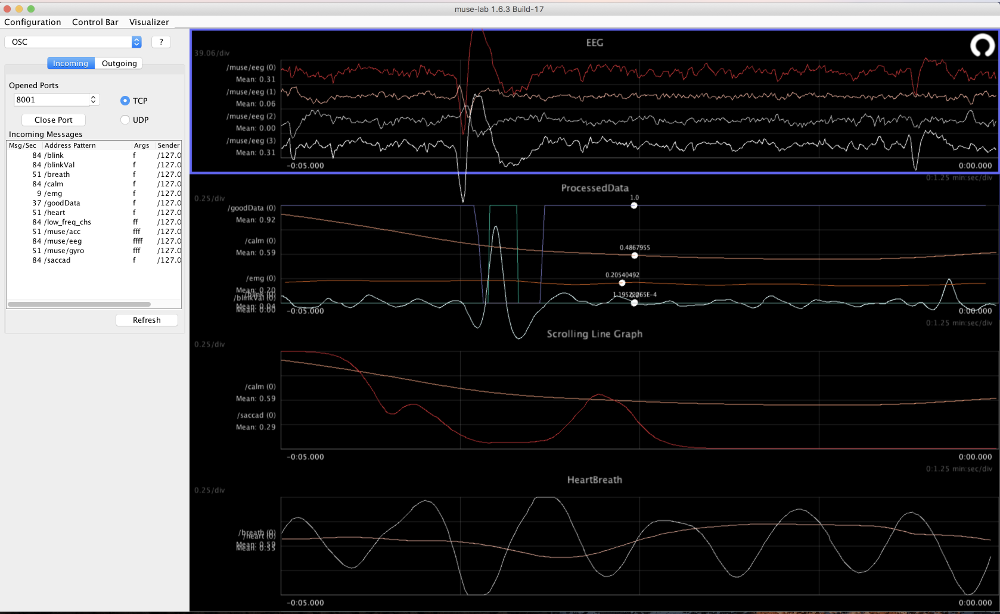

# README #

This repo contains Tenere specific signal processing for the Muse headband.   
* Processing is done in python and uses numpy and scipy.   
* Data is sent in and out using pyliblo (OSC)

## What it currently does
* filters the EEG data to remove noise and make it zero mean (gets rid of the approx 800 offset in the data
* downsamples the EEG data to 80 Hz to make it easier on Tenere LX
* detects blinks and sends the info out as a binary variable and filtered waveform
* detects saccadic eye movement and sends out the magnituds as a smoothly varying signal
* has a simple slow varying metric called calm that increases when the your eyes become still 
* band powers for each channel (delta, theta, alpha, beta, gamma)
* band ratios for each channel (beta/alpha, theta/alpha)
* emg power for 1 channel (very controllable using jaw clench)
* Headband status indicator (HSI) from variance of each channel to judge signal quality,  this can be sent back to museStatus.py running on the Pi to show signal quality on the Blinkt LED strip
* low_freq outout for each ear
* Heart beat filter: extracts heart relate movement of the muse.  Works if you are sitting still (meditation), and works better when you wear the muse around your neck like a pair of headphones. 
* Breath filter: extracts breath realated movement of the muse.  work best if you wear the muse around your neck.  


## Installation:

This easiest way to get up and running is to install Anaconda Python 3.6
(`https://www.continuum.io/downloads`)

Create an Anaconda environment using the environment configuration file provided in this repo:

```
conda env create -f environment.yml
```

Next activate the enviroment.   If you are using osc or linux,  do it like this:

```
source activate musetools
```

Now run the signal processing script to listen for muse data coming in from muse-listener.py by configuring with --port,   and choose where to send the processed data (--oscip,  --oscport).   If you want to send data directly to Tenere, use (--port 7878)

```
python museProc_tenere.py --port 9810 --oscip 127.0.0.1 --oscport 8001 
```

Visualize the data using MuseLab (`http://developer.choosemuse.com/research-tools`)
Use the configuration file `muselab_configurationTenere.json` to have muselab automatically configured to listen to port `8001` and plot the data.   



### Use MuseLab to forward the OSC messages to Tenere:
* Choose OSC in the pulldown menu
* Select Outgoing
* hostname is: `127.0.0.1` or the IP address of Tenere computer, Port is `7878` 
* `UDP`
* Then select the messages you want to forward. 

You can now visualize the data as well as use it in Tenere!!
* tip:  if you click on a graph in muselab,  you can use the arrow keys to change the scale and speed. 
* Check out documentation for muselab at `http://dev.choosemuse.com/research-tools/getting-started`

### Sending signal quality status back to the Pi
If you want to send signal quality data back to the Pi, use (--spareip, --sparse port)
Run `museStatus.py` on the Pi and plug in your Pimironi `Blinkt` LEDs
```
python museProc_tenere.py --port 9810 --oscip 127.0.0.1 --oscport 8001 --sparseip 10.0.0.14 --sparseport 1234
```


